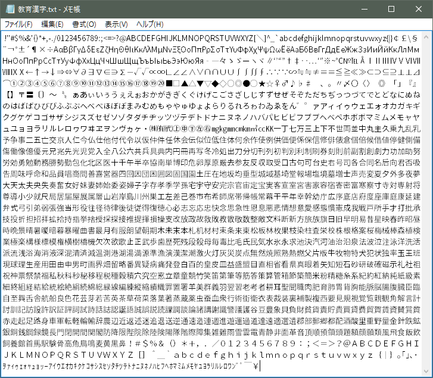

# Arduino-misakiUTF16
Arduino用 美咲フォントライブラリ 教育漢字・内部フラッシュメモリ乗せ版

## 概要
Arduino用の美咲フォントドライバライブラリです。

フォントを教育漢字1,006字(小学校で習う漢字）＋ひらがな・カタカナ・記号・半角等の1,710字に絞って  
Arduino Uno(Atmega328)のフラッシュメモリ上に格納しました。  

収録文字  

## 仕様
* 文字コード  UTF16/UTF-8  
* フォントサイズ  8x8ドッド（美咲フォント)  
* 利用可能フォント数  1,710字（Arduinoのフラッシュメモリ上に格納）  
  * 漢字 教育漢字 1,006字(小学校で習う漢字）  
  * 非漢字 全角 546字(全角英数字、ひらがな、かたかな、記号)  
  * 半角フォント  158字(半角記号、半角英数、半角カタカナ）  
  
## 利用可能API
* UTF8文字列をUTF16文字列に変換する  
`byte Utf8ToUtf16(uint16_t* pUTF16, char *pUTF8)`  
 * 引数  
 `pUTF16`: UTF16文字列格納アドレス(OUT)  
 `pUTF8`: UTF8文字列格納アドレス(IN)  
 * 戻り値  
 変換したUTF16文字列の長さ(変換失敗時は-1を返す)  

* UTF8文字(1～3バイト)をUTF16(2バイト)に変換する  
  `byte charUFT8toUTF16(char *pUTF8, uint16_t *pUTF16)`
 * 引数  
 `pUTF16`: UTF16文字格納アドレス(OUT)  
 `pUTF8`: UTF8文字格納アドレス(IN)  
 * 戻り値  
 変換処理したUTF8文字のバイト数(0～3、変換失敗時は0を返す)  

* UTF16半角コード(記号英数字、カナ)をUTF16全角コードに変換する  
  `uint16_t utf16_HantoZen(uint16_t utf16)`  
 * 引数  
 `utf16`: UTF16文字コード(IN)  
 * 戻り値  
 変換処理したUTF16文字コード(指定したコードが全角の場合はそのままコードを返す)  

* 半角カナを全角に変換  
  `uint16_t hkana2kana(uint16_t ucode)`  
 * 引数  
 `ucode`: UTF16文字コード(IN)  
 * 戻り値  
 変換処理したUTF16文字コード(指定したコードが全角の場合はそのままコードを返す)  

* UTF16に対応するフォントデータ(8バイト)取得  
  `boolean getFontDataByUTF16(byte* fontdata, uint16_t utf16)`    
 * 引数  
 `fontdata`: フォントデータ格納アドレス(OUT)  
 `utf16`: UTF16文字コード(IN)  
 * 戻り値  
 true: 正常終了 false: 異常終了  

* UTF8文字列に対応する先頭文字のフォントデータ取得  
  `char* getFontData(byte* fontdata,char *pUTF8,bool h2z=false)`  
 * 引数  
 `fontdata`: フォントデータ格納アドレス(OUT)  
 `pUTF8`: UTF8文字列(IN)  
 `h2z`: 半角全角変換指定(IN)  true：全角変換あり false 全角変換なし(省略時デフォルト)  
 * 戻り値  
 変換を行った文字の次位置のアドレスを返す(文列末は0x00を指す位置となる).    
 取得失敗時はNULLを返す.  

*  フォントデータテーブル先頭アドレス取得  
  `const uint8_t* getFontTableAddress()`
 * 引数  
 なし  
 * 戻り値  
フォントデータを格納しているデータ領域の先頭アドレスを返す.  
アドレスはフラッシュメモリ領域であるため領域参照はpgm_read_byte()を利用する必要がある.  

* 利用可能フォントの検索    
`int findcode(uint16_t  ucode)`  
 * 引数  
 `ucode`: UTF16文字コード(IN)  
 * 戻り値  
 指定したコードに対するフォントコード(0～1709)を返す.   
 該当するフォントが存在ししない場合は-1 を返す.  
 本関数で取得したコードはフォントデータテーブル上の格納順番を示すコードである.  
 フォントの格納アドレスの取得は次の記述で行える.  
  getFontTableAddress()+findcode(ucode)*8  

## サンプルスケッチ
banner  

misaki_tvout  

aitendo_ht16k33  

