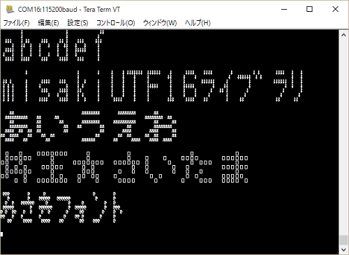

# Arduino-misakiUTF16
Arduino用 美咲フォントライブラリ 教育漢字・内部フラッシュメモリ乗せ版

##概要
Arduino用の美咲フォントドライバライブラリです。

フォントを教育漢字1,006字(小学校で習う漢字）＋ひらがな・カタカナ・記号・半角等の1,710字に絞って  
Arduino Uno(Atmega328)のフラッシュメモリ上に格納しました。  

##仕様
* 文字コード  UTF16/UTF-8  
* フォントサイズ  8x8ドッド（美咲フォント)  
* 利用可能フォント数  1,710字（Arduinoのフラッシュメモリ上に格納）  
  * 漢字 教育漢字 1,006字(小学校で習う漢字）  
  * 非漢字 全角 546字(全角英数字、ひらがな、かたかな、記号)  
  * 半角フォント  158字(半角記号、半角英数、半角カタカナ）  
  
##利用可能API
* UTF8文字列をUTF16文字列に変換する  
  utf8ToUtf1()  
* UTF8文字をUTF16に変換  
  charUFT8toUTF16()  
* UTF16半角コードをUTF16全角コードに変換  
  utf16_HantoZen()  
* 半角カナを全角に変換  
  hkana2kana()  
* UTF16に対応するフォントデータ取得  
  getFontDataByUTF16()  

##サンプル

