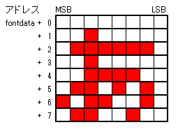
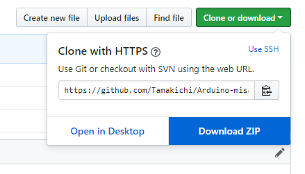
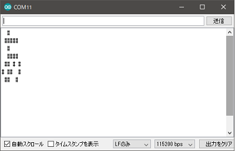
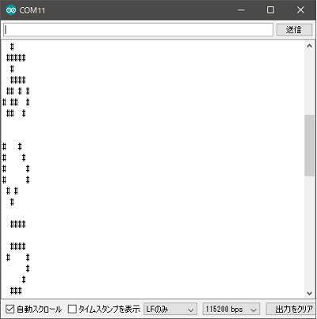
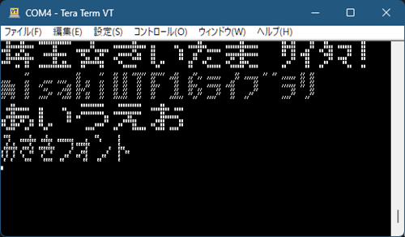
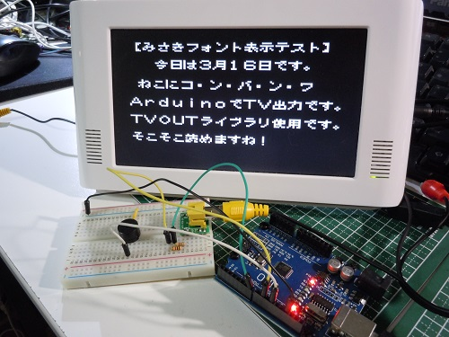
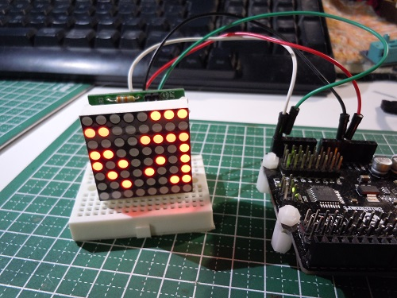
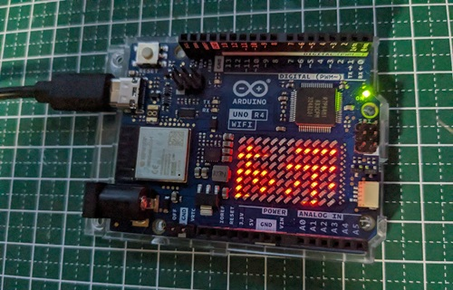

# Arduino-misakiUTF16

Arduino用 美咲フォントライブラリ 教育漢字・内部フラッシュメモリ乗せ版

## 更新情報

2025/11/08 更新 v1.3  
・関数名の Typo（charUFT8toUTF16 → charUTF8toUTF16）対応  
・1バイトデータの扱いのデータ型がbyte、char、uint8_tと入り乱れていた.uint8_tに統一  
・エラー対策、処理の見直し  
・コメント、説明文の追記・修正  

2024/03/18 更新 v1.2  
・美咲フォントの最新版 2021-05-05(美咲ゴシック第2)利用に変更  
　(以前は2012-06-03 正式公開初版を利用)  
・isZenkaku()の追加、  
　⇒ 半角(4ドット)・全角(8ドット)幅判定により半角文字を詰めて表示可能となりました  
・いくつかのバグ対応(半角・全角変換ミスなど)  

## 概要

Arduino用の美咲フォントドライバライブラリです。

フォントを教育漢字1,006字(小学校で習う漢字）＋ひらがな・カタカナ・記号・半角等の1,710字に絞って  
Arduino Uno(Atmega328)のフラッシュメモリ上に格納しました。  
本ライブラリは約16kバイト、フラッシュメモリを消費します。

※ 美咲フォントは、Little Limitさんが開発し、配布しているフォントです。  
   8×8 ドット日本語フォント「美咲フォント」  
   <http://littlelimit.net/misaki.htm>

### 収録文字  

````txt
!"#$%&'()*+,-./0123456789:;<=>?@ABCDEFGHIJKLMNOPQRSTUVWXYZ[\]^_`abcdefghi
jklmnopqrstuvwxyz{|}¢£¥§¨¬°±´¶×÷ΑΒΓΔΕΖΗΘΙΚΛΜΝΞΟΠΡΣΤΥΦΧΨΩαβγδεζηθικλμνξοπρ
στυφχψωЁАБВГДЕЖЗИЙКЛМНОПРСТУФХЦЧШЩЪЫЬЭЮЯабвгдежзийклмнопрстуфхцчшщъыьэюяё
‐―‖‘’“”†‡‥…′″※‾℃№℡ÅⅠⅡⅢⅣⅤⅥⅦⅧⅨⅩ←↑→↓⇒⇔∀∂∃∇∈∋∑−√∝∞∟∠∧∨∩∪
∫∬∮∴∵∽≒≠≡≦≧≪≫⊂⊃⊆⊇⊥⊥⊿⌒①②③④⑤⑥⑦⑧⑨⑩⑪⑫⑬⑭⑮⑯⑰⑱⑲⑳■□▲△▼▽◆◇○◎●◯
★☆♀♂♪♭♯　、。〃々〆〇〈〉《》「」『』【】〒〓〔〕〜〝〟ぁあぃいぅうぇえぉおか
がきぎくぐけげこごさざしじすずせぜそぞただちぢっつづてでとどなにぬねのはばぱひび
ぴふぶぷへべぺほぼぽまみむめもゃやゅゆょよらりるれろゎわゐゑをん゛゜ゝゞァアィイ
ゥウェエォオカガキギクグケゲコゴサザシジスズセゼソゾタダチヂッツヅテデトドナニヌ
ネノハバパヒビピフブプヘベペホボポマミムメモャヤュユョヨラリルレロヮワヰヱヲンヴ
ヵヶ・ーヽヾ㈱㈲㈹㊤㊥㊦㊧㊨㎎㎏㎜㎝㎞㎡㏄㏍一丁七万三上下不世両並中丸主久乗九乱
乳予争事二五亡交京人仁今仏仕他付代令以仮仲件任休会伝似位低住体何余作使例供価便係
保信修俳俵倉個倍候借値停健側備傷働像億優元兄兆先光児党入全八公六共兵具典内円冊再
写冬冷処出刀分切刊列初判別利制刷券刻則前副割創劇力功加助努労効勇勉動務勝勢勤包化
北区医十千午半卒協南単博印危卵厚原厳去参友反収取受口古句可台史右号司各合同名后向
君否吸告周味呼命和品員唱商問善喜営器四回因団困囲図固国園土圧在地坂均垂型城域基埼
堂報場塩境墓増士声売変夏夕外多夜夢大天太夫央失奏奮女好妹妻姉始委姿婦子字存孝季学
孫宅宇守安完宗官宙定宝実客宣室宮害家容宿寄密富寒察寸寺対専射将尊導小少就尺局居届
屋展属層山岩岸島川州巣工左差己巻市布希師席帯帰帳常幕干平年幸幹幼庁広序底店府度座
庫庭康延建弁式弓引弟弱張強当形役往径待律後徒従得復徳心必志忘応忠快念思急性恩息悪
悲情想意愛感態慣憲成我戦戸所手才打批承技投折担招拝拡拾持指挙捨授採探接推提揮損操
支改放政故救敗教散敬数整敵文料断新方旅族旗日旧早明易昔星映春昨昭昼時晩景晴暑暖暗
暮暴曜曲書最月有服朗望朝期木未末本札机材村束条来東松板林枚果枝染柱査栄校株根格案
桜梅械棒森植検業極楽構様標模権横樹橋機欠次欲歌止正武歩歯歴死残段殺母毎毒比毛氏民
気水氷永求池決汽河油治沿泉法波泣注泳洋洗活派流浅浴海消液深混清済減温測港湖湯満源
準漁演漢潔潮激火灯灰災炭点無然焼照熟熱燃父片版牛牧物特犬犯状独率玉王班現球理生産
用田由申男町画界畑留略番異疑病痛発登白百的皇皮皿益盛盟目直相省看県真眼着矢知短石
砂研破確磁示礼社祖祝神票祭禁福私秋科秒秘移程税種穀積穴究空窓立章童競竹笑笛第筆等
筋答策算管箱節築簡米粉精糖糸系紀約紅納純紙級素細終組経結給統絵絶絹続綿総緑線編練
縦縮績織罪置署羊美群義羽翌習老考者耕耳聖聞職肉肥育肺胃背胸能脈脳腸腹臓臣臨自至興
舌舎航船良色花芸芽若苦英茶草荷菜落葉著蒸蔵薬虫蚕血衆行術街衛衣表裁装裏補製複西要
見規視覚覧親観角解言計討訓記訪設許訳証評詞試詩話誌認誕語誠誤説読課調談論諸講謝識
警議護谷豆豊象貝負財貧貨責貯貴買貸費貿賀賃資賛賞質赤走起足路身車軍転軽輪輸辞農辺
近返述迷追退送逆通速造連週進遊運過道達遠適選遺郡部郵郷都配酒酸里重野量金針鉄鉱銀
銅銭鋼録鏡長門閉開間関閣防降限陛院除陸険陽隊階際障集雑難雨雪雲電青静非面革音頂順
預領頭題額顔願類風飛食飯飲飼養館首馬駅験骨高魚鳥鳴麦黄黒鼻！＃＄％＆（）＊＋，．
／０１２３４５６７８９：；＜＝＞？＠ＡＢＣＤＥＦＧＨＩＪＫＬＭＮＯＰＱＲＳＴＵＶ
ＷＸＹＺ［］＾＿｀ａｂｃｄｅｆｇｈｉｊｋｌｍｎｏｐｑｒｓｔｕｖｗｘｙｚ｛｜｝｡｢｣､
･ｦｧｨｩｪｫｬｭｮｯｰｱｲｳｴｵｶｷｸｹｺｻｼｽｾｿﾀﾁﾂﾃﾄﾅﾆﾇﾈﾉﾊﾋﾌﾍﾎﾏﾐﾑﾒﾓﾔﾕﾖﾗﾘﾙﾚﾛﾜﾝﾞﾟ￣￥
````

## 仕様

* 文字コード  UTF16/UTF-8  
* フォントサイズ  8x8ドッド（美咲フォント)  
* フォント格納形式  


* 利用可能フォント数  1,710字（Arduinoのフラッシュメモリ上に格納）  
  * 漢字 教育漢字 1,006字(小学校で習う漢字)  
  * 非漢字 全角 546字(全角英数字、ひらがな、かたかな、記号)  
  * 半角フォント  158字(半角記号、半角英数、半角カタカナ)  

* 制約事項
  * UTF-8文字は1～3バイト文字にのみ対応、4バイト文字は非対応  

## インストール方法

ライブラリ公開先のリンクをクリックし、ページ右上の「Clone or download」を  
クリックして、さらに「Dounload ZIP」をクリックするとダウンロードできます。
  

ダウンロード後、ファイルを解凍し、フォルダ内のmisakiUTF16 フォルダを  
各自のライブラリ配置場所（\libraries）に入れます。  

## API関数

### ■ UTF8文字列をUTF16文字列に一括変換  

【書式】  
`int16_t Utf8ToUtf16(uint16_t* pUTF16, const char *pUTF8))`  

【引数】  
`pUTF16`: UTF16文字列格納アドレス(OUT)  
`pUTF8`: UTF8文字列格納アドレス(IN)  

【戻り値】  
変換したUTF16文字列の長さ(変換失敗時は-1を返す)  

【説明】  
`pUTF8`のアドレスに格納されているUTF8コード文字列を、UTF16コードに変換し、  
`pUTF16`のアドレスに格納します。  
半角文字を含め、すべての文字は2バイトコードであるUTF16に変換されますので、  
`pUTF16`には十分な領域を確保してください。  
変換したUTF16文字領域を確保しない、１文字単位で変換を行う`charUTF8toUTF16()`、  
1文字単位でフォントデータを取得する`getFontData()`での代替えも可能です。
  
### ■ 先頭UTF8文字(1～3バイト)をUTF16(2バイト)に変換  

【書式】  
`uint8_t charUTF8toUTF16(uint16_t* pUTF16, const char* pUTF8)`

【引数】  
`pUTF16`: UTF16文字格納アドレス(OUT)  
`pUTF8`: UTF8文字格納アドレス(IN)  

【戻り値】  
変換処理したUTF8文字のバイト数(0～3、変換失敗時は0を返す)  

【説明】  
`pUTF8`のアドレスに格納されている先頭の１文字UTF8コード文字列を、  
UTF16コードに変換し、 `pUTF16`のアドレスに格納します。  
次文字を処理する場合は、戻り値のバイト数分を`pUTF8`に加算して、  
再度`charUFT8toUTF16()`を呼び出します。  

※本関数は4バイト文字には対応していません。  
未対応文字を扱う可能性がある場合は、戻り値を確認し適切な処理を行って下さい。

### ■ UTF16半角コード(記号英数字、カナ)をUTF16全角コードに変換  

【書式】  
`uint16_t utf16_HantoZen(uint16_t utf16)`  

【引数】  
`utf16`: UTF16文字コード(IN)  

【戻り値】  
変換処理したUTF16文字コード(指定したコードが全角の場合はそのままコードを返す)  

【説明】  
`utf16`で指定したUTF16半角文字コードをUTF16全角文字コードに変換します。  
指定した文字が半角文字でない場合は、その値をそのまま返します。  
半角文字としては、記号英数字、カナが対象となります。  

### ■ 全角判定  

【書式】  
`boolean isZenkaku(uint16_t utf16)`  

【引数】  
`utf16`: UTF16文字コード(IN)  

【戻り値】  
true：指定した文字コードが全角幅フォントである  
false：指定した文字コードが半角幅フォントである  

【説明】  
指定した文字コードが全角幅(8ドット)か半角幅(4ドット)かを判定します。  

### ■ 半角カナを全角に変換  

【書式】  
`uint16_t hkana2kana(uint16_t utf16)`  

【引数】  
`utf16`: UTF16文字コード(IN)  

【戻り値】  
変換処理したUTF16文字コード(指定したコードが全角の場合はそのままコードを返す)

【説明】  
`utf16`で指定したUTF16半角カタカナに対応するUTF16全角文字コードを返します。  
半角文字でない場合は、その値をそのまま返します。  

### ■ UTF16文字に対応するフォントデータ(8バイト)取得  

【書式】  
`boolean getFontDataByUTF16(uint8_t* fontdata, uint16_t utf16)`  

【引数】  
`fontdata`: フォントデータ格納アドレス(OUT)  
`utf16`: UTF16文字コード(IN)  

【戻り値】  
`true`: 正常終了 `false`: 異常終了  

【説明】  
`utf16`で指定したUTF16コードに対応するフォントデータを取得し、  
`fontdata`のアドレスに格納します。該当するフォントが存在しない場合は、  
"□"：豆腐（ コード：`0x25a1`）フォントを格納します。  

（注意）  
戻り値は該当するフォントが無く、"□"：豆腐取得の場合でも`true`を返します。  
異常終了は、何等かの理由で豆腐フォントも取得できない場合です。  

### ■ UTF8文字列に対応する先頭文字のフォントデータ取得  

【書式】  
`char* getFontData(uint8_t* fontdata, const char *pUTF8, boolean h2z=false)`  

【引数】  
`fontdata`: フォントデータ格納アドレス(OUT)  
`pUTF8`: UTF8文字列(IN)  
`h2z`: 半角全角変換指定(IN)  `true`：全角変換あり `false` 全角変換なし(省略時デフォルト)  

【戻り値】  
変換を行った文字の次位置のアドレスを返します(文列末は0x00を指す位置となる)。  
取得失敗時は`NULL`(=0)を返します。  

【説明】  
UTF8文字列が格納されているアドレス`pUTF8`より、先頭から1文字を取得し、  
対応するフォントデータを`fontdata`に格納します。  
該当フォントが存在しない場合、"□"：豆腐（ コード：`0x25a1`）フォントを格納します。  
戻り値として、`pUTF8`に格納されている次の文字のアドレスを返します。  
何らかのエラーが生じた場合は`NULL`(=0)を返します。  

### ■ フォントデータテーブル先頭アドレス取得  

【書式】  
`const uint8_t* getFontTableAddress()`

【引数】  
なし  

【戻り値】  
フォントデータを格納しているデータ領域の先頭アドレスを返します。  

【説明】  
フォントデータテーブルの先頭アドレスを返します。  
AVR環境で利用する場合、アドレスはフラッシュメモリ領域となります。  
領域参照は`pgm_read_byte()`を利用する必要があります。  
ARM、EPS8266、ESP32環境では通常のメモリアドレスとして参照可能です。  

フォントテーブル内の任意の文字の格納アドレスは次の計算で取得できます。  
`getFontTableAddress() + findcode(ucode)*7`  

### ■ フォントの検索  

【書式】  
`int16_t findcode(uint16_t  ucode)`  

【引数】  
`ucode`: UTF16文字コード(IN)  

【戻り値】  
指定したコードに対するフォントコード(0～1709)を返します。  
該当するフォントが存在ししない場合は-1 を返します。  
本関数で取得したコードはフォントデータテーブル上の格納順番を示すコードです。  

【説明】  
フォントテーブル内の任意の文字の格納アドレスは次の計算で取得できます。  
`getFontTableAddress()+findcode(ucode)*7`  

AVR環境で利用する場合、アドレスはフラッシュメモリ領域となります。  
領域参照は`pgm_read_byte()`を利用する必要があります。  
ARM、EPS8266、ESP32環境では通常のメモリアドレスとして参照可能です。  

## ライブラリの使い方

### 簡単な記述例１（１文字分のフォント取得）

````cpp
#include <misakiUTF16.h>

void setup() {
Serial.begin(115200);

char font[8];              // フォント格納バッファ
getFontData(font, "あ");   // "あ"のフォントを取得

// 取得フォントの確認
for (uint8_t row=0; row<8; row++) {
    for (uint8_t col=0; col<8; col++) {
    Serial.write( (0x80>>col) & font[row] ? '#':' ');
    }
    Serial.write('\n');
}
}

void loop() {

}
````

実行結果  
  

フォントデータの取得処理は、`getFontData(font,"あ")` のみで完了です。  
後半のネストしている`for`文は取得したフォントの確認用です。  

### 簡単な記述例2（文字列分のフォントを繰り返し取得）

````cpp
#include <misakiUTF16.h>

void setup() {
  Serial.begin(115200);

  char font[8];                       // フォント格納バッファ
  char *str="Abcあいうえお、埼玉";    // 文字列

  char *ptr = str;
  while(*ptr) {  // 文字列分ループ
     ptr = getFontData(font, ptr);   // 1文字分のフォント取得
     if (!ptr)
        break;                       // エラーの場合は終了

    // 取得フォントの確認
    for (uint8_t row=0; row<8; row++) {
      for (uint8_t col=0; col<8; col++) {
         Serial.write( (0x80>>col) & font[row] ? '#':' ');
      }
      Serial.write('\n');
    }
  }
}

void loop() {

}
````

実行結果  
  

文字列に対しても、`getFontData()`関数で処理できます。  
UTF8文字コードは可変バイト長なのですが、`getFontData()`関数は  
次の文字へのポインタを返すので簡単に逐次取得処理を実装出来ます。  

ちなみに、`getFontData()`関数の省略している第3引数にtrueを指定すると  
半角文字は全角文字に変換してフォントデータを取得します。  

## サンプルスケッチの実行結果

添付のサンプルスケッチの実行結果を示します。  
スケッチの処理内容については、各スケッチを直接参照下さい。  

■ banner  


コンソール(シリアルポート)にキャラクターを使ったバナー表示をします。  
半角文字は横幅4ドットで表示しています。  

■ misaki_tvout(TVoutライブラリ利用)  


Arduino uno 3(atmega328)用のTVoutライブラリを利用してビデオ出力を行うデモです。  

■ aitendo_ht16k33  


aitendoで販売しているLEDドライバHT16K33を利用したLEDドットマトリックス表示を行うデモです。  

■ led_matrix_scroll  


Arduino Uno R4 WiFiボードに搭載しているLEDマトリックスにて文字表示を行うデモです。

## ライセンスについて

本フォントライブラリは、「美咲フォント」と同様にフリー（自由な）ソフトウエアです。  
あらゆる改変の有無に関わらず、また商業的な利用であっても、  
自由にご利用、複製、再配布することができます。  
ただし、全て無保証とさせていただきます。  
