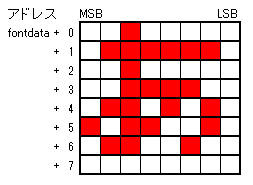

# Arduino-misakiUTF16
Arduino用 美咲フォントライブラリ 教育漢字・内部フラッシュメモリ乗せ版

## 概要
Arduino用の美咲フォントドライバライブラリです。

フォントを教育漢字1,006字(小学校で習う漢字）＋ひらがな・カタカナ・記号・半角等の1,710字に絞って  
Arduino Uno(Atmega328)のフラッシュメモリ上に格納しました。  

収録文字  


## 仕様
* 文字コード  UTF16/UTF-8  
* フォントサイズ  8x8ドッド（美咲フォント)  
* フォント格納形式  


* 利用可能フォント数  1,710字（Arduinoのフラッシュメモリ上に格納）  
  * 漢字 教育漢字 1,006字(小学校で習う漢字）  
  * 非漢字 全角 546字(全角英数字、ひらがな、かたかな、記号)  
  * 半角フォント  158字(半角記号、半角英数、半角カタカナ）  
  

## インストール方法
ライブラリ公開先のリンクをクリックし、ページ右上の「Clone or download」を  
クリックして、さらに「Dounload ZIP」をクリックするとダウンロードできます。
  

ダウンロード後、ファイルを解凍し、フォルダ内のmisakiUTF16 フォルダを  
各自のライブラリ配置場所（\libraries）に入れます。  


## API関数
### ■ UTF8文字列をUTF16文字列に一括変換  
【書式】  
`int16_t Utf8ToUtf16(uint16_t* pUTF16, char *pUTF8)`  

【引数】  
`pUTF16`: UTF16文字列格納アドレス(OUT)  
`pUTF8`: UTF8文字列格納アドレス(IN)  

【戻り値】  
変換したUTF16文字列の長さ(変換失敗時は-1を返す)  

【説明】  
`pUTF8`のアドレスに格納されているUTF8コード文字列を、UTF16コードに変換し、  
`pUTF16`のアドレスに格納します。  
半角文字を含め、すべての文字は2バイトコードであるUTF16に変換されますので、  
`pUTF16`には十分な領域を確保してください。  
変換したUTF16文字領域を確保しない、１文字単位で変換を行う`charUFT8toUTF16()`、  
1文字単位でフォントデータを取得する`getFontData()`での代替えも可能です。
  
### ■ 先頭UTF8文字(1～3バイト)をUTF16(2バイト)に変換  
【書式】  
`byte charUFT8toUTF16(char *pUTF8, uint16_t *pUTF16)`

【引数】  
`pUTF16`: UTF16文字格納アドレス(OUT)  
`pUTF8`: UTF8文字格納アドレス(IN)  

【戻り値】  
変換処理したUTF8文字のバイト数(0～3、変換失敗時は0を返す)  

【説明】  
`pUTF8`のアドレスに格納されている先頭の１文字UTF8コード文字列を、  
UTF16コードに変換し、 `pUTF16`のアドレスに格納します。  
次文字を処理する場合は、戻り値のバイト数分を`pUTF8`に加算して、  
再度`charUFT8toUTF16()`を呼び出します。


### ■ UTF16半角コード(記号英数字、カナ)をUTF16全角コードに変換  
【書式】  
`uint16_t utf16_HantoZen(uint16_t utf16)`  
 
【引数】  
`utf16`: UTF16文字コード(IN)  

【戻り値】  
変換処理したUTF16文字コード(指定したコードが全角の場合はそのままコードを返す)  

【説明】  
`utf16`で指定したUTF16半角文字コードをUTF16全角文字コードに変換します。  
指定した文字が半角文字でない場合は、その値をそのまま返します。  
半角文字としては、記号英数字、カナが対象となります。  


### ■ 半角カナを全角に変換  
【書式】  
`uint16_t hkana2kana(uint16_t utf16)`  

【引数】  
`utf16`: UTF16文字コード(IN)  

【戻り値】  
変換処理したUTF16文字コード(指定したコードが全角の場合はそのままコードを返す)

【説明】  
`utf16`で指定したUTF16半角カタカナに対応するUTF16全角文字コードを返します。  
半角文字でない場合は、その値をそのまま返します。  

### ■ UTF16文字に対応するフォントデータ(8バイト)取得  
【書式】  
`boolean getFontDataByUTF16(byte* fontdata, uint16_t utf16)`    

【引数】  
`fontdata`: フォントデータ格納アドレス(OUT)  
`utf16`: UTF16文字コード(IN)  
 
【戻り値】  
`true`: 正常終了 `false`: 異常終了  

【説明】  
`utf16`で指定したUTF16コードに対応するフォントデータを取得し、  
`fontdata`のアドレスに格納します。該当するフォントが存在しない場合は、  
"□"：豆腐（ コード：`0x25a1`）フォントを格納します。  

（注意）  
戻り値は該当するフォントが無く、"□"：豆腐取得の場合でも`true`を返します。  
異常終了は、何等かの理由で豆腐フォントも取得できない場合です。  


### ■ UTF8文字列に対応する先頭文字のフォントデータ取得  
【書式】  
`char* getFontData(byte* fontdata, char *pUTF8,bool h2z=false)`  

【引数】  
`fontdata`: フォントデータ格納アドレス(OUT)  
`pUTF8`: UTF8文字列(IN)  
`h2z`: 半角全角変換指定(IN)  `true`：全角変換あり `false` 全角変換なし(省略時デフォルト)  

【戻り値】  
変換を行った文字の次位置のアドレスを返します(文列末は0x00を指す位置となる)。  
取得失敗時は`NULL`(=0)を返します。  

【説明】  
UTF8文字列が格納されているアドレス`pUTF8`より、先頭から1文字を取得し、  
対応するフォントデータを`fontdata`に格納します。  
該当フォントが存在しない場合、"□"：豆腐（ コード：`0x25a1`）フォントを格納します。  
戻り値として、`pUTF8`に格納されている次の文字のアドレスを返します。  
何らかのエラーが生じた場合は`NULL`(=0)を返します。  


### ■ フォントデータテーブル先頭アドレス取得  
【書式】  
`const uint8_t* getFontTableAddress()`

【引数】  
なし  

【戻り値】  
フォントデータを格納しているデータ領域の先頭アドレスを返します。    

【説明】  
フォントデータテーブルの先頭アドレスを返します。  
AVR環境で利用する場合、アドレスはフラッシュメモリ領域となります。  
領域参照は`pgm_read_byte()`を利用する必要があります。  
ARM、EPS8266、ESP32環境では通常のメモリアドレスとして参照可能です。  

フォントテーブル内の任意の文字の格納アドレスは次の計算で取得できます。  
`getFontTableAddress() + findcode(ucode)*8`  


### ■ フォントの検索    
【書式】  
`int findcode(uint16_t  ucode)`  

【引数】  
`ucode`: UTF16文字コード(IN)  

【戻り値】  
指定したコードに対するフォントコード(0～1709)を返します。      
該当するフォントが存在ししない場合は-1 を返します。   
本関数で取得したコードはフォントデータテーブル上の格納順番を示すコードです。   

【説明】  
フォントテーブル内の任意の文字の格納アドレスは次の計算で取得できます。  
`getFontTableAddress()+findcode(ucode)*8`  

AVR環境で利用する場合、アドレスはフラッシュメモリ領域となります。  
領域参照は`pgm_read_byte()`を利用する必要があります。  
ARM、EPS8266、ESP32環境では通常のメモリアドレスとして参照可能です。  

## ライブラリの使い方
### 簡単な記述例１（１文字分のフォント取得）

````sample1.ino
#include <misakiUTF16.h>

void setup() {
Serial.begin(115200);

char font[8];              // フォント格納バッファ
getFontData(font, "あ");   // "あ"のフォントを取得

// 取得フォントの確認
for (uint8_t row=0; row<8; row++) {
    for (uint8_t col=0; col<8; col++) {
    Serial.write( (0x80>>col) & font[row] ? '#':' ');
    }
    Serial.write('\n');
}
}

void loop() {

}
````
実行結果  
  

フォントデータの取得処理は、`getFontData(font,"あ")` のみで完了です。  
後半のネストしている`for`文は取得したフォントの確認用です。  

### 簡単な記述例2（文字列分のフォントを繰り返し取得）
````sample2.ino
#include <misakiUTF16.h>

void setup() {
  Serial.begin(115200);

  char font[8];                       // フォント格納バッファ
  char *str="Abcあいうえお、埼玉";    // 文字列

  char *ptr = str;
  while(*ptr) {  // 文字列分ループ
     ptr = getFontData(font, ptr);   // 1文字分のフォント取得
     if (!ptr)
        break;                       // エラーの場合は終了
       
    // 取得フォントの確認
    for (uint8_t row=0; row<8; row++) {
      for (uint8_t col=0; col<8; col++) {
         Serial.write( (0x80>>col) & font[row] ? '#':' ');
      }
      Serial.write('\n');
    }
  }
}

void loop() {

}
````

実行結果  
  

文字列に対しても、`getFontData()`関数で処理できます。  
UTF8文字コードは可変バイト長なのですが、`getFontData()`関数は  
次の文字へのポインタを返すので簡単に逐次取得処理を実装出来ます。  

ちなみに、`getFontData()`関数の省略している第3引数にtrueを指定すると  
半角文字は全角文字に変換してフォントデータを取得します。  


## サンプルスケッチの実行結果
添付のサンプルスケッチの実行結果を示します。  
スケッチの処理内容については、各スケッチを直接参照下さい。  

banner  


misaki_tvout  


aitendo_ht16k33  

